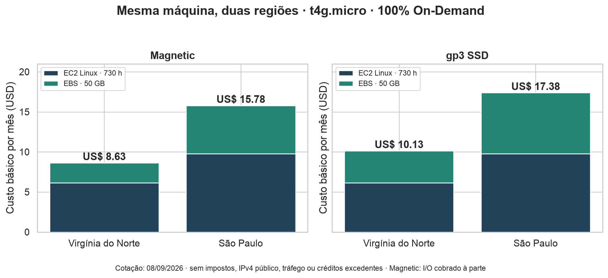

# FarmTech Solutions — Fase 5

**Eduardo Rick · RM573745 · entrega individual**  
Machine Learning e Computação em Nuvem · FIAP · 08/09/2026

A FarmTech Solutions analisa condições climáticas e produtividade agrícola de quatro culturas
para apoiar uma fazenda de 200 hectares. Esta entrega reúne uma investigação reproduzível de
Machine Learning e a estimativa de infraestrutura AWS para uma futura API de sensores e previsão.

## Comece pelo notebook

**[Abrir notebook executado: EduardoRick_rm573745_pbl_fase4.ipynb](EduardoRick_rm573745_pbl_fase4.ipynb)**

Toda a análise exploratória, os cinco algoritmos, a validação por cenários, a interpretação dos
clusters, os outliers e as conclusões estão no notebook. Os resultados foram executados e
verificados; consulte [o relatório da execução](resultados/verificacao.json).

A base original é [crop_yield.csv](dados/crop_yield.csv). O nome do notebook mantém o sufixo
`pbl_fase4` conforme a exigência literal do enunciado da Fase 5. As unidades de rendimento e
precipitação apresentam inconsistências aparentes, discutidas no notebook; não foram feitas
conversões sem comprovação.

## Vídeos obrigatórios

| Entrega | YouTube — não listado | Limite |
|---|---|---|
| 1 — Machine Learning | [Assistir à demonstração de Machine Learning](https://youtu.be/z8DZlMXLSPU) | 5 minutos |
| 2 — Computação em Nuvem | **PENDENTE: inserir link do vídeo de AWS** | 5 minutos |


## Executar e reproduzir

Recomendado: **Python 3.12**. Na raiz deste repositório:

```bash
python3 -m venv .venv
source .venv/bin/activate
python -m pip install -r requirements-lock.txt
python scripts/verificar.py
jupyter lab EduardoRick_rm573745_pbl_fase4.ipynb
```

No Windows, substitua a ativação por `.venv\Scripts\activate`. No JupyterLab, use o kernel
Python desse ambiente. `scripts/verificar.py` inicia um kernel limpo, executa todas as células,
confere as saídas, atualiza as conclusões numéricas e exporta [uma versão HTML](docs/notebook.html)
para leitura offline. No GitHub, o HTML deve ser baixado para abrir no navegador; o `.ipynb`
é o arquivo principal para leitura e correção.

`requirements.txt` fixa as bibliotecas diretas; `requirements-lock.txt` registra também as
transitivas usadas na execução. A instalação inicial requer internet; o notebook usa a base
local. `scripts/gerar_notebook.py` recria a estrutura sem saídas e só deve ser usado para manutenção,
seguido de `scripts/verificar.py`. Nunca entregue apenas a estrutura não executada.

## Entrega 2 — comparação AWS

### Premissas iguais nas duas regiões

Cotação consultada em **08/09/2026, horário de Brasília**, em **USD**, com a
[AWS Pricing Calculator](https://calculator.aws/#/estimate?id=8aa59e66259f40a43e409e78e6bb216ae658d91c). Nenhum recurso foi contratado ou implantado.

| Item | Configuração |
|---|---|
| Regiões | São Paulo (`sa-east-1`) e Virgínia do Norte (`us-east-1`) |
| Sistema / tenancy | Linux / Shared Instances |
| Quantidade / uso | 1 instância, uso constante, 730 horas/mês |
| Compra | On-Demand, 100% de utilização mensal, sem Savings Plans, reserva ou Spot |
| Máquina | 2 vCPUs, 1 GiB de RAM, rede **até** 5 Gbps |
| Armazenamento principal | 50 GB de EBS Magnetic, geração anterior, sem snapshots |
| Alternativa de armazenamento | 50 GB de gp3 SSD, 3.000 IOPS e 125 MB/s básicos |
| Descontos | Nenhum Free Tier ou crédito promocional aplicado |
| Não incluídos no total básico | Impostos, câmbio, IPv4 público, tráfego, I/O Magnetic e CPU excedente |

**100% de utilização na calculadora significa máquina ligada durante o mês, não CPU a 100%.**
As instâncias T têm desempenho de CPU em rajadas. A rede “até 5 Gbps” também é um limite de
rajada, não largura de banda sustentada garantida. “2 CPUs” foi interpretado como 2 vCPUs,
conforme a configuração EC2. A AWS usa GB = 1024³ bytes em sua página de preços EBS;
foi informado **50 no campo GB da calculadora**, mantendo o critério do exercício.
Fontes: [especificações T4g](https://aws.amazon.com/ec2/instance-types/t4/) e
[preços EBS](https://aws.amazon.com/ebs/pricing/).

### Qual máquina custa menos?

As três opções abaixo atendem a CPU, memória e rede solicitadas. Os preços por hora foram
lidos na tabela da calculadora; a memória de cálculo está nas [evidências de São Paulo](docs/aws/sao-paulo-magnetic-calculo.txt)
e [da Virgínia](docs/aws/virginia-gp3-calculo.txt).

| Instância | Arquitetura | Virgínia: USD/h | São Paulo: USD/h | Virgínia: EC2 + HD/mês | São Paulo: EC2 + HD/mês |
|---|---|---:|---:|---:|---:|
| **t4g.micro** | ARM64 / Graviton2 | 0,0084 | 0,0134 | **8,63** | **15,78** |
| t3a.micro | x86-64 / AMD | 0,0094 | 0,0151 | 9,36 | 17,02 |
| t3.micro | x86-64 / Intel | 0,0104 | 0,0168 | 10,09 | 18,26 |

**A alternativa mais barata entre as configurações comparadas é t4g.micro na Virgínia do Norte.**
A arquitetura ARM exige sistema, bibliotecas e eventuais imagens de contêiner compatíveis com
ARM64. A execução local do notebook não substitui um teste na EC2 Linux/ARM. Se uma dependência
exigir x86-64, t3a.micro é a alternativa de menor preço entre as duas x86 comparadas.
A t2.micro foi descartada porque possui apenas uma vCPU.
[Especificações das famílias](https://aws.amazon.com/ec2/instance-types/general-purpose/).

### Comparação principal — 50 GB de HD Magnetic

[Reabrir a estimativa somente com HD nas duas regiões](https://calculator.aws/#/estimate?id=bcc6af2355064625370dc8e8260e4efd3b0df906).

| Componente | Virgínia do Norte | São Paulo |
|---|---:|---:|
| EC2: tarifa × 730 h, antes do arredondamento | US$ 6,132 | US$ 9,782 |
| Magnetic: tarifa por GB-mês | US$ 0,050 | US$ 0,120 |
| Magnetic: 50 GB/mês | US$ 2,50 | US$ 6,00 |
| **Total mensal exibido** | **US$ 8,63** | **US$ 15,78** |
| **Projeção de 12 meses na calculadora** | **US$ 103,56** | **US$ 189,36** |
| Custo inicial | US$ 0,00 | US$ 0,00 |

São Paulo custa **US$ 7,15 a mais por mês**, ou **82,85% acima da Virgínia**, considerando os
totais mensais exibidos. Escolher a Virgínia economiza **45,31% em relação a São Paulo**.
A diferença na projeção de 12 meses exibida é **US$ 85,80**.

**Arredondamento:** a calculadora arredonda cada total mensal para centavos e depois projeta
12 meses. Se calcularmos diretamente `8,632 × 12` e `15,782 × 12`, obtemos US$ 103,584 e
US$ 189,384, respectivamente. A tabela segue os valores exibidos pela calculadora; o
[CSV de custos](docs/aws/comparacao_custos.csv) preserva os valores antes e depois do arredondamento.
Não se trata de contrato de 12 meses nem de reserva.

### Por que Magnetic e uma alternativa SSD?

O exercício usa a palavra **HD**. Magnetic atende literalmente ao armazenamento magnético de
50 GB; os volumes HDD atuais `st1` e `sc1` têm mínimo de 125 GiB e não são volumes de boot.
Magnetic é uma tecnologia anterior, adequada aqui à comparação literal, mas não é a primeira
escolha para uma API que fará pequenas leituras e escritas aleatórias.
[Tipos de volumes EBS](https://docs.aws.amazon.com/ebs/latest/userguide/ebs-volume-types.html).

Como alternativa técnica, gp3 oferece SSD com desempenho básico independente da capacidade:
3.000 IOPS e 125 MB/s incluídos. Esses são limites do volume; o desempenho efetivo também depende
da instância, do sistema e da carga.
[Documentação gp3](https://docs.aws.amazon.com/ebs/latest/userguide/general-purpose.html).

| t4g.micro + 50 GB gp3 | Virgínia do Norte | São Paulo |
|---|---:|---:|
| gp3 por GB-mês | US$ 0,080 | US$ 0,152 |
| gp3 50 GB/mês | US$ 4,00 | US$ 7,60 |
| **EC2 + gp3 por mês** | **US$ 10,13** | **US$ 17,38** |
| **12 meses, conforme arredondamento da calculadora** | **US$ 121,56** | **US$ 208,56** |

Em São Paulo, a troca do Magnetic pelo gp3 custa **US$ 1,60/mês** a mais no custo básico,
antes de considerar as operações cobradas do Magnetic. Esta é uma alternativa explicitamente
identificada como SSD, não uma alegação de que gp3 seja HD magnético.



### Custos variáveis e limites da estimativa

A calculadora EC2 usada nesta entrega calcula a capacidade Magnetic, mas não apresenta campo
para seu volume de operações. As tarifas foram complementadas pelo **catálogo público oficial**
[da Virgínia](docs/aws/precos-oficiais-us-east-1.json) e
[de São Paulo](docs/aws/precos-oficiais-sa-east-1.json), que registram URL de origem, SKU,
descrição, unidade e vigência. A consulta reproduzível está em `scripts/consultar_precos_aws.py`.

| Adicional | Como estimar |
|---|---|
| Operações Magnetic — Virgínia | US$ 0,05 por milhão de I/Os: `0,05 × operações / 1.000.000` |
| Operações Magnetic — São Paulo | US$ 0,12 por milhão de I/Os: `0,12 × operações / 1.000.000` |
| Um IPv4 público | US$ 0,005/h × 730 = **US$ 3,65/mês**, em ambas as regiões |
| CPU T4g Unlimited excedente | US$ 0,04 por vCPU-hora excedente; depende do consumo e dos créditos |
| Transferência e snapshots | Dependem do volume, destino e retenção; não dimensionados pelo enunciado |
| Impostos e conversão monetária | Não incluídos; não foi usado câmbio arbitrário |

Exemplo **ilustrativo**, não medição da fazenda: com um milhão de I/Os mensais e um IPv4 público,
os totais Magnetic seriam **US$ 12,33/mês na Virgínia** e **US$ 19,55/mês em São Paulo**.
Para gp3 com desempenho básico e um IPv4, seriam **US$ 13,78** e **US$ 21,03**, respectivamente.
Tráfego, impostos e CPU excedente permanecem fora desses exemplos.

O enunciado não informa frequência, quantidade de sensores nem tamanho dos pacotes. Por isso
não seria correto afirmar que o custo básico é a fatura completa de uma API em produção.
Fontes: [IPv4 público](https://aws.amazon.com/vpc/pricing/) e
[créditos de CPU T4g](https://aws.amazon.com/ec2/instance-types/t4/).

### Escolha para a fazenda: São Paulo

**Escolheria São Paulo (`sa-east-1`)**, mantendo dados dos sensores, logs que contenham esses
dados e backups no Brasil. A restrição de armazenamento no exterior é uma premissa expressa
do exercício, portanto prevalece sobre a economia possível na Virgínia.

Para sensores e usuários no Brasil, a proximidade da região tende a reduzir o percurso da rede
e o tempo de ida e volta. Isso é uma expectativa técnica, não uma medição: o resultado depende
do provedor, localização da fazenda e roteamento. Antes de produção, mediria latência p50/p95
na conexão real, tempo de inferência, uso de memória e comportamento sob concorrência.
A banda de até 5 Gbps não garante baixa latência e não compensa, por si só, a distância geográfica.
[Orientações AWS para escolha de regiões](https://docs.aws.amazon.com/wellarchitected/latest/hybrid-networking-lens/hnperf02-bp04.html).

A **LGPD não deve ser apresentada como uma proibição geral de transferência internacional**:
a ANPD regulamenta mecanismos para transferência de dados pessoais. Além disso, medições
climáticas não são automaticamente dados pessoais. Neste caso, a decisão de residência nacional
se sustenta na restrição específica dada pelo problema; se houvesse dados pessoais associados,
seria necessário avaliar os requisitos aplicáveis.
[ANPD — transferência internacional de dados](https://www.gov.br/anpd/pt-br/assuntos/assuntos-internacionais/transferencia-internacional-de-dados).

A diferença de **US$ 7,15/mês** no cenário HD compra adequação à restrição do exercício e uma
região mais próxima dos usuários brasileiros. Para uma futura implementação, recomendaria
**t4g.micro + gp3 em São Paulo**, sujeito ao teste de compatibilidade ARM e de memória. O custo
básico seria US$ 17,38/mês; a alternativa literal com HD continua documentada por US$ 15,78.

Um GiB deve ser tratado como restrição da cotação, não garantia de capacidade. Para inferência
leve, a máquina é uma candidata; treinamento, concorrência alta, disponibilidade contínua,
redundância e recuperação de falhas exigiriam dimensionamento adicional. Uma única instância
é um ponto de falha. Não foram criados recursos para testar desempenho real nesta atividade.


### Evidências da calculadora

- [Comparação principal com Magnetic, duas regiões](https://calculator.aws/#/estimate?id=bcc6af2355064625370dc8e8260e4efd3b0df906).
- [Comparação completa com HD e SSD](https://calculator.aws/#/estimate?id=8aa59e66259f40a43e409e78e6bb216ae658d91c). **Cada linha é uma alternativa. O total geral soma cenários e não representa a solução escolhida.**
- [Configuração Magnetic de São Paulo](docs/aws/sao-paulo-magnetic-configuracao.png) e [memória de cálculo](docs/aws/sao-paulo-magnetic-calculo.txt).
- [Configuração Magnetic da Virgínia](docs/aws/virginia-magnetic-configuracao.png) e [memória de cálculo](docs/aws/virginia-magnetic-calculo.txt).
- [Configuração gp3 de São Paulo](docs/aws/sao-paulo-gp3-configuracao.png) e [memória de cálculo](docs/aws/sao-paulo-gp3-calculo.txt).
- [Configuração gp3 da Virgínia](docs/aws/virginia-gp3-configuracao.png) e [memória de cálculo](docs/aws/virginia-gp3-calculo.txt).

As imagens são capturas reais da calculadora; o gráfico comparativo foi gerado a partir das
cotações verificadas. Os arquivos `.txt` transcrevem a estrutura e os valores visíveis da página,
não são exportações oficiais do serviço. Os links compartilhados permitem reabrir as estimativas;
a AWS informa expiração após um ano.

## Organização

| Artefato | Finalidade |
|---|---|
| `EduardoRick_rm573745_pbl_fase4.ipynb` | Relatório completo de ML, código e saídas executadas |
| `dados/` | CSV original |
| `resultados/` | Métricas, divisões, gráficos e verificação |
| `docs/aws/` | Evidências, preços, links e comparação de custos |
| `docs/notebook.html` | Cópia para leitura offline |
| `scripts/` | Reprodução e conferência dos artefatos |

**Prazo:** 08/09/2026, antes da meia-noite de Brasília. Finalizar vídeos e links, conferir o
repositório público e enviar no portal antes do limite. Após enviar, não realizar novos commits.
